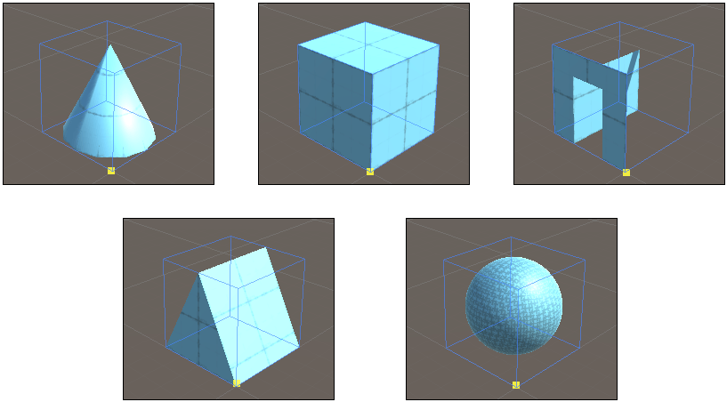

# Create a predefined ProBuilder shape

Use the [Shape tool](shape-tool.md) to create a ProBuilder mesh from a predefined shape primitive. 

## The bounding box

Although the shape is predefined, you set its dimensions yourself by defining the size of the shape's bounding box. The size of the box is based on x, y, and z values, which start on the "first corner" of the box: the first click you make in the **Scene** view when you draw. 

If you change the shape primitive of a shape while working on it, ProBuilder instantly adjusts the dimensions of the shape to fit within the bounding box.

## Create a shape

1. In the **Scene** view, select the **Create Shape** tool from the **Tools** overlay:
    * Use a short click to draw the selected shape.
    * Use a long click to display a list of predefined shapes to choose from.
1. To define the bounding box, you can either:
    * Draw it directly in the **Scene** view.
    * Set its size in the **Create Shape** panel, and then:
        1. Click in the **Scene** view to tell ProBuilder where to place the new shape. 
        1. Drag sideways and up to complete the extrusion according to the dimensions you set.

ProBuilder always builds the new shape on top of any existing mesh in the scene or, if there is no mesh under your mouse, on the plane defined in the [settings for Unity's Grid snapping](https://docs.unity3d.com/Manual/GridSnapping.html).

## Duplicate last shape

To create a copy of the previous shape you created, hold **Shift** to display a preview of it and then click in the **Scene** view to create it. 

After you create a Mesh shape, you can use any of the [ProBuilder editing tools](workflow-edit.md) to fine-tune or customize that shape further. For example, you can build a plain cube and then use the **Extrude Face** and **Delete Face** tools to create windows and doorways to make a house.

To create a Mesh from a predefined shape:  

1. In the Scene view, in the Tools overlay, select and hold the **Create Shape** tool to display the a list of pre-defined shapes. 
1. Select the shape you want to create to display the **Shape Settings** overlay for that shape. 
1. In the **Shape Settings** ovelerlay, set parameters for the shape you created. For example, the [Stairs](Stair.md) shape lets you customize the height of the steps, how curved to make them, and whether to create faces for the sides. 
1. To display a preview of the shape you selected, press **Shift**. 
> **Tip**: Click in the Scene view to create a mesh out of the preview shape. 
1. To draw the bounding boxes of your shape manually, do the following: 
    1. In the Scene view, click and hold your left mouse button to draw the base of the bounding box along the x-axis and the z-axis.
    1. Release the mouse button to create the base of your shape.
    1. Move your mouse up or down the y-axis to draw the height of your shape.
    1. Click to finalize the new Mesh.
  > **Note**: If you draw the shape on an axis-aligned plane, enable auto-snapping to set a more accurate size on the defined shape than drawing freehand. Alternatively, you can move the shape by increments defined by the [Increment Snap](https://docs.unity3d.com/Manual/GridSnapping.html#grid-and-snap) value instead. For more information, see [Snapping](shape-tool.md#Snapping). 