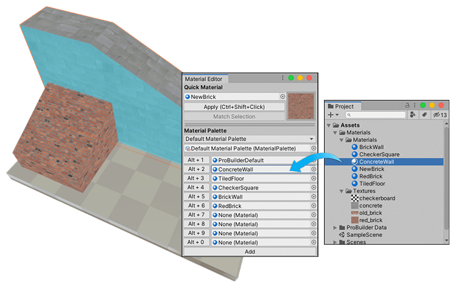

# Creating and Applying Materials

Use the [Material Editor](material-tools.md) to easily manage Materials you are using in the Scene. You can carry out a number of editing tasks, including the following: 

* [Setting a quick Material](material-tools.md#qset) and then using a hotkey to [apply it](material-tools.md#qapply) to the selected face(s).
* [Assigning up to 10 Materials](material-tools.md#set) to hotkeys and buttons in the editor so you can easily [apply multiple Materials to faces](material-tools.md#apply) without having to use the Project view to find them. 
* [Defining extra Material slots](material-tools.md#wells) in your Palette so that you can manage extra Materials at once.
* [Saving your Material arrangement](material-tools.md#save) in a new Material Palette so that you can find it easily and re-use it in other Scenes and Projects.
* [Loading](material-tools.md#load) a previously saved Material Palette into the Material Editor.

The Materials you use in the Material Editor are standard Unity Materials. If you want to create your own standard Unity Material, follow the instructions in [Creating a material asset and assigning a Unity shader to it](https://docs.unity3d.com/Manual/materials-introduction.html#creating-a-material) in the Unity manual. For Texture Materials, follow the instructions in [Creating a Texture Material](#texmat).

**Note**: If you are using either the [Universal Render Pipeline](https://docs.unity3d.com/Manual/universal-render-pipeline.html) (URP) or the [High Definition Render Pipeline](https://docs.unity3d.com/Manual/high-definition-render-pipeline.html) (HDRP), you also need to import the corresponding URP or HDRP Shaders needed to display vertex colors and textures correctly. For more information, see [Support for scriptable render pipelines](installing.md).

## Creating a Texture Material

Before you create the Material, make sure you have a 2-dimensional image file (BMP, JPG, PNG, TIF etc.). Then follow these instructions:

1. Right-click in the Project view, in the folder you want to place the Material file, and select **Create** > **Material** from the context menu.

  Alternatively, you can use the main menu (**Assets** > **Create** > **Material**).

2. Name the Material file. For example, you could describe the look or use of the Texture, such as "BrickWall" or "CheckeredTile".

  The Shader properties appear in the Inspector.

3. [Set a reference](https://docs.unity3d.com/Manual/EditingValueProperties.html) to the Texture file you want to use in the **Albedo** property.

	

Now that you have a Texture Material, you can [set it as the quick Material](material-tools.md#qset), [add it to your Material Palette](material-tools.md#palette), and [apply it to a whole object or only specific faces](material-tools.md#apply).

